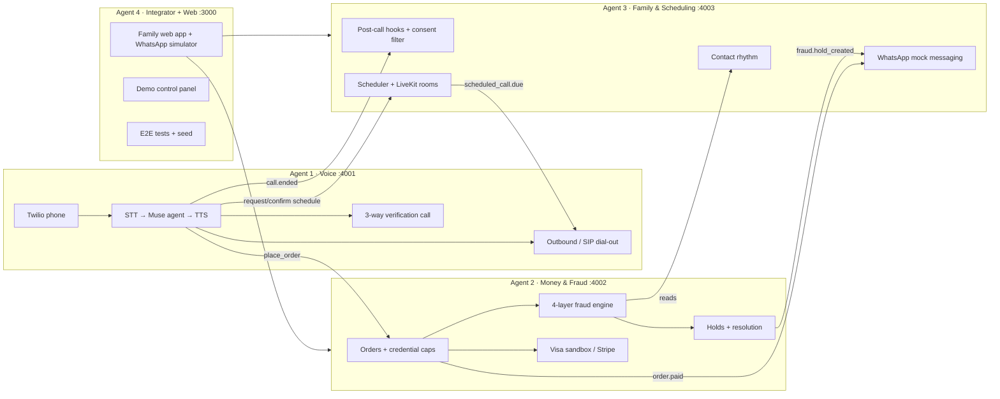

# Care Circle — Build Kit (v2)
*Meta + Visa · Muse for all reasoning · 4 Claude agents on 4 computers → one product*

This kit has six files:

| File | Who reads it |
|---|---|
| `README.md` (this file) | You (the human coordinator) and every agent |
| `CONTRACTS.md` | **Every agent, first.** The shared interfaces that let four agents build in parallel without talking to each other. |
| `agent-1-voice.md` | Computer 1 → put in the repo as that agent's `CLAUDE.md` |
| `agent-2-money-fraud.md` | Computer 2 |
| `agent-3-family-schedule.md` | Computer 3 |
| `agent-4-integrator-web.md` | Computer 4 |

---

## 1. What's new in v2

### A. AI fraud detection (a full engine, not a single rule)
Older adults' reported fraud losses rose from about $600M in 2020 to $2.4B in 2024 (FTC). Friend-and-family impersonation, tech-support, and prize scams are the classic ones. Gift cards are the payment method scammers ask for most, while wire transfers carry the biggest losses.

Care Circle checks **every** purchase request through four layers:

| Layer | What it catches | Can the model override it? |
|---|---|---|
| **1. Hard rules** | Gift cards to non-circle recipients, wire transfers, crypto, new payees, over-cap amounts, "keep it secret" language | **No.** These are deterministic. |
| **2. Scam-story classifier (Muse)** | Reads *why* Rose is buying. It maps her words to known scam types: grandparent impostor, government/Medicare impostor, tech support, prize/lottery, romance, investment, cash courier. | Adds risk |
| **3. Personal baseline** | Anomalies against Rose's own 60-day history: unusual merchant, amount 5× her median, a 2am request | Adds risk |
| **4. Relationship signal** | Uses the family's real contact pattern. *"Caller claimed to be Danny. Danny talks to Rose every Sunday and called 2 days ago. He's never asked for money. This 'emergency' isn't in any family channel."* | Adds risk |

**What happens when risk is high:**

1. **Hold, never scold.** Rose hears: *"This looks like a trick a lot of people get calls about. Let's check with Danny first. Want me to call him now?"*
2. **Verify on a known number.** The agent calls Danny on the number stored in the circle, *never* on a number the caller provided. This defeats voice-clone "grandson" calls, because the real Danny answers his real phone.
3. **Three-way call.** Rose and Danny talk live, and Danny confirms or cancels out loud.
4. **Family code word.** The family sets a private phrase. The agent reminds Rose to ask any future "emergency" caller for it.
5. **Cooling-off.** If no verifier answers within 30 minutes, the purchase holds for 24 hours. **High-risk holds never auto-release.** Releasing one needs a family member's passkey.
6. **"Why we paused" card.** The family gets a plain-English explanation on WhatsApp, with no jargon and no shaming.

The engine also handles the tricky legit cases. *"A $25 gift card for Mia's birthday"* goes through, because Mia is in the circle, her birthday is on the calendar, and the amount is normal. The target on the eval set is to **catch every scam with no more than 2 false holds in 24 scenarios.**

### B. Scheduling time with the children
The AI makes it easy to *see* family, not just buy things.

1. **Three ways to trigger it:**
   - Rose says *"I'd love to see the kids."*
   - A family member messages *"set up a call with Mom."*
   - The AI notices a gentle gap, like the Sunday call being missed twice. It nudges **the family, never Rose**, and never with guilt.
2. **Solving the constraints.** The AI works with:
   - Rose's routine (naps, church, booked rides)
   - Each member's time zone and availability, from WhatsApp poll replies or seeded calendars
   - Grandkids' school hours, which come through their parent (kids under 18 are never messaged directly)
3. **Proposals.** Three slots with a reason each, sent to family on WhatsApp. They tap to accept.
4. **Confirming with Rose by voice.** *"Sunday at 4. Lisa, Danny, and Mia will all be on. Sound good?"*
5. **Pre-call briefing.** Each family member gets a consent-filtered list of what Rose mentioned lately: *"Her tomatoes came in. She's worried about Buddy's vet visit."*
6. **In-person visits too.** *"Lisa's visiting Saturday. Want groceries for lunch?"* This reuses the grocery and ride tools, so commerce and connection stay in one loop.
7. **Recurring rituals.** *"Make this our Sunday call?"* It rotates fairly across siblings.

**Fraud synergy:** a steady rhythm of real calls makes the *fake* ones stand out. The scheduler's contact data feeds fraud layer 4.

### C. The call itself: it rings Grandma's regular phone
No app, no link, no "tap to join."
- At call time, **Rose's normal phone rings.**
- The call bridges her audio into a video room where the family is on camera.
- **Plan A:** LiveKit room plus SIP dial-out to Rose's phone.
- **Plan B (if SIP fights you):** a "senior tablet" page that auto-answers calls from circle members only, with huge buttons.
- The AI speaks once to open (*"Rose, Lisa and the kids are here!"*), then **leaves the call.**

---

## 2. Architecture



**Stack:** TypeScript everywhere (pnpm monorepo). Node services (Fastify). Next.js web. One Postgres with **one schema per agent**. `openai` SDK pointed at Muse (`https://api.meta.ai/v1`).

**Ownership rule:** every agent writes **only** inside its own folder and its own DB schema. Cross-service access goes through the HTTP APIs in `CONTRACTS.md`, never through another agent's tables. That's what keeps merges conflict-free.

```
care-circle/
  packages/contracts/     ← Agent 4 owns (types from CONTRACTS.md)
  services/voice/         ← Agent 1
  services/money/         ← Agent 2
  services/family/        ← Agent 3
  apps/web/               ← Agent 4
  e2e/                    ← Agent 4
  status/AGENT-{1..4}.md  ← each agent writes only its own
  CONTRACTS.md            ← changed only by the human
```

---

## 3. The 72-hour plan

| Phase | Hours | Agent 1 · Voice | Agent 2 · Money & Fraud | Agent 3 · Family & Schedule | Agent 4 · Integrator + Web |
|---|---|---|---|---|---|
| **0 · Setup + riskiest spike** | 0–3 | **Latency spike:** Twilio → STT → Muse → TTS round trip. Go/no-go on Muse Transcribe for streaming. | Visa sandbox auth working (else Stripe test mode). Hard-rule module. | LiveKit room creation. WhatsApp mock message store. | Monorepo scaffold, `packages/contracts` types, docker Postgres, `pnpm dev` runs everything. |
| **1 · Stubs** | 3–8 | Stub endpoints return canned data per contract | Stub endpoints | Stub endpoints | Web shell with WhatsApp simulator reading stubs. Seed IDs. |
| ✅ **Checkpoint 1 (H8)** | | *All four services run together on stubs. Human merges to `main`.* | | | |
| **2 · Real happy path** | 8–30 | Real voice loop. Tools: `place_order`, `check_budget`, `get_family_context`. `call.ended` event. | Real orders, caps, payments. Layer 3 baseline from seeded history. | Hook extraction + consent filter. `order.paid` → "add something?" nudges. | Family inbox. Order and receipt cards. E2E scenario 1 (grocery happy path). |
| ✅ **Checkpoint 2 (H30)** | | *Rose orders groceries by phone → paid → Lisa gets a nudge. End to end.* | | | |
| **3 · Fraud + scheduling** | 30–50 | Verification 3-way call. Scheduling tools. Outbound dial / SIP dial-out for scheduled calls. | Layers 2 + 4. Holds, resolution, cooling-off. 24-scenario eval set. | Scheduler (constraints → 3 slots). Proposals. Briefings. Contact rhythm endpoint. `scheduled_call.due`. | Fraud "why we paused" card, passkey release, schedule UI, senior-tablet page (Plan B), demo control panel. |
| ✅ **Checkpoint 3 (H50)** | | *Scam → hold → 3-way call → cancel. And: schedule → confirm → phone rings → family video. Both end to end.* | | | |
| **4 · Harden** | 50–62 | Interruptions, "never mind," silence, accents | Tune thresholds on the eval set (target: 24/24 scams caught, ≤2 false holds) | Edge cases: nobody available, time-zone collisions, a declined slot | E2E × 10, seed polish, rehearse the demo |
| 🧊 **Feature freeze (H62)** | | | | | |
| **5 · Ship** | 62–72 | Standby for bugs | Standby | Standby | **Record the demo by H66.** Write-up, README, repo cleanup. |

---

## 4. How four agents stay in sync (they can't talk to each other)

Each Claude runs in its own session on its own computer, with no shared memory. Everything they share goes through **the repo** and **you**.

1. **`CONTRACTS.md` is the law.** Agents build against it from minute one, stubbing whatever they depend on.
2. **Stub first, real later.** By H8, every endpoint exists and returns realistic canned data. Nobody is ever blocked waiting on another agent.
3. **Status files.** Each agent keeps `status/AGENT-N.md` updated with: done, in progress, blocked on, and contract change requests.
4. **Contract changes go through you.** An agent writes a `CONTRACT CHANGE REQUEST` in its status file. You approve it, edit `CONTRACTS.md`, Agent 4 updates `packages/contracts`, and you tell the other agents to pull.
5. **Branches:** `agent-1-voice`, `agent-2-money`, `agent-3-family`, `agent-4-web`. **You** merge to `main` at each checkpoint. Folder ownership means conflicts should be near zero.
6. **Pull `main` at every checkpoint** and re-run `pnpm dev` + `pnpm e2e`.
7. **Agent 4 is the integrator.** After each merge it runs E2E and writes failures into the owning agent's status file under `BUGS FROM INTEGRATION`.

### Your job as the human coordinator
- Hour 0: create the repo, drop `CONTRACTS.md` at the root, give each computer its agent file as `CLAUDE.md`, and create the shared `.env` with API keys.
- Every ~2 hours: skim all four status files and relay blockers.
- Approve contract changes quickly. A stalled contract stalls two agents.
- Do the checkpoint merges.
- Be the tester for anything involving a real phone. The agents can't hear the call.
- If you have teammates, put one human per computer and keep yourself as coordinator.

---

## 5. Demo (3:00) — updated for v2

| Time | Scene |
|---|---|
| 0:00 | *"Older adults reported losing $2.4 billion to scams last year. Most of those scams start with a phone call from someone pretending to be family."* |
| 0:10 | Rose calls, orders groceries, and mentions her tomatoes. **Paid.** Lisa gets *"Add something?"* and adds a pastry and a voice note. |
| 0:40 | Rose: *"I'd love to see the kids."* Lisa's and Danny's phones get 3 proposed slots. They tap Sunday 4pm. The agent confirms with Rose by voice. |
| 1:05 | **The scam.** Rose: *"My grandson called. He's in trouble and needs $500 in gift cards, and he said not to tell his mom."* On screen, the fraud engine lights up: hard rule (gift card, non-circle recipient), classifier (grandparent impostor, secrecy language), relationship signal (Danny called Sunday and never mentioned it). |
| 1:25 | *"Let's check with Danny first."* The three-way call connects to Danny's known number. The real Danny: *"Grandma, that wasn't me!"* He cancels out loud. Lisa's phone gets the "why we paused" card. |
| 1:55 | **Sunday, 4pm.** Rose's regular phone rings. She picks up and she's in the family video call. Danny's pre-call briefing mentioned the tomatoes, so he asks about them first. The AI says one line, then leaves. |
| 2:30 | Week view: *11 connection moments. 1 scam stopped. $500 saved.* |
| 2:45 | Close: *"The best fraud protection is a family that calls. Care Circle makes sure they do."* |

---

## Sources
- FTC press release, *Protecting Older Consumers 2024–2025*: https://www.ftc.gov/news-events/news/press-releases/2025/12/ftc-issues-annual-report-congress-agencys-actions-protect-older-adults
- FTC report PDF: https://www.ftc.gov/system/files/ftc_gov/pdf/P144400-OlderAdultsReportDec2025.pdf
- FTC on impersonation scam losses (2025): https://ftc.gov/news-events/news/press-releases/2025/08/ftc-data-show-more-four-fold-increase-reports-impersonation-scammers-stealing-tens-even-hundreds
- FTC 2023 estimate of true losses (up to $61.5B): https://www.ftc.gov/node/86563
- FTC findings on scam types and payment methods (via FKKS): https://advertisinglaw.fkks.com/post/102ft8z/ftc-says-protecting-older-americans-is-one-of-its-top-priorities
- Visa Intelligent Commerce: https://developer.visa.com/capabilities/visa-intelligent-commerce
- Muse Spark / Meta Model API: https://developer.meta.com/ai/resources/blog/build-with-muse-spark/
