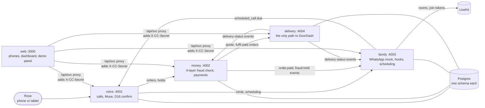

# Care Circle

A phone helper for Rose (81). She orders groceries by voice, her family stays in the loop on WhatsApp, and every purchase goes through a four-layer scam check before any money moves. It also books family video calls that ring her regular phone.

The shared interfaces are in [`CONTRACTS.md`](CONTRACTS.md) and [`docs/CONTRACTS-ADDENDUM.md`](docs/CONTRACTS-ADDENDUM.md). Where the two disagree, the addendum wins.

## Architecture

Five services and a web app, one Postgres. Each service writes only its own schema and reaches the others over HTTP.



| Service | Port | Owns |
|---|---|---|
| **voice** | 4001 | Rose's calls (Twilio, Deepgram, Muse). Builds orders from what she says and only buys after a clear "yes" (D16). Runs verification calls to a family member's stored number. |
| **money** | 4002 | The fraud engine: layer 1 hard rules (deterministic, never overridden by a model), layer 2 scam-story classifier, layer 3 "unusual for Rose", layer 4 family patterns. Holds, cooling-off, passkey release, payments. |
| **family** | 4003 | The circle, the WhatsApp-style messages, post-call hooks and nudges, fraud cards, contact rhythm, scheduling, and LiveKit rooms. |
| **delivery** | 4004 | Grocery quotes and fulfilment. It only fulfils orders money has already approved **and** charged, and checks the cart against the approved amount and a cap. |
| **web** | 3000 | Everything on screen. The browser never talks to a service directly: `/api/svc` checks an allowlist and adds the shared secret on the server. |

**A grocery order, end to end:** Rose asks → voice builds the list → money prices it from a delivery quote → fraud check → Rose confirms the read-back → money pays → delivery builds the cart (a dry run by default) → the family's phones show the order, the store, and the delivery status.

## Run it

You need Node 22.12+, pnpm 10 (`corepack enable`), and Docker.

```bash
pnpm install
cp .env.example .env          # set CC_INTERNAL_SECRET (≥24 chars, same for the whole team); MOCK=1 needs no other keys
docker compose up -d --wait   # Postgres with the voice/money/family/web schemas
pnpm seed                     # family → money → delivery → voice
pnpm dev                      # all five, labeled output
pnpm health                   # in a second terminal: expect five green rows
```

Keep `MOCK=1`, `MOCK_DEPENDENCIES=0`, `DELIVERY_PROVIDER=mock`, and `DOORDASH_LIVE_CHECKOUT=0` unless you are on the demo laptop. Never add `PORT=` to `.env`. Per-teammate setup is in [`docs/agents/COMMON-SETUP.md`](docs/agents/COMMON-SETUP.md).

Then open http://localhost:3000.

| Page | What it is |
|---|---|
| `/family` | Lisa's, Danny's, and Mark's phones: the WhatsApp-style chat with Care Circle, including where the groceries are |
| `/dashboard` | Rose's week, paused purchases, recent orders with delivery status, and "See how we decided" (all four fraud layers) |
| `/demo` | Recording controls: each scenario without a real phone, fast-forward to the next call, the DoorDash quote table, and "Reset all data" |
| `/call/:id` | The family video room (LiveKit). `?member=mem_lisa` joins as Lisa |
| `/tablet` | Plan B for Rose: one big button, auto-answers only calls from her own schedule |

## Run the demo

Everything runs on one machine. No phone line, Twilio, tunnel or LiveKit is needed.

1. **`.env` keys:**
   - `CC_INTERNAL_SECRET` (≥24 chars) and `MOCK=1`. Here `MOCK=1` fakes only Twilio, LiveKit and payments.
   - `META_API_KEY` with `MUSE_MODEL=muse-spark-1.3`. This key drives both Muse reasoning and Muse Voice Transcribe. Without it, voice falls back to the keyword bot and the `.txt` transcripts.
   - Optional: `DEEPGRAM_API_KEY`, to transcribe mp3/m4a clips.
   - Optional: `VOICE_REASONER=mock` forces the keyword bot, and `MUSE_TIMEOUT_MS` sets the Muse timeout (default 12000).
   - DoorDash: `DELIVERY_PROVIDER=doordash_thirdparty` with `DOORDASH_MCP_URL`, `DOORDASH_MCP_TOKEN` (the same token the MCP server was started with), `DOORDASH_DROPOFF_ADDRESS`, `DOORDASH_GROCERY_STORE` and **`DOORDASH_LIVE_CHECKOUT=0`**. Or use `DELIVERY_PROVIDER=mock`. Check the DoorDash setup with `pnpm dd:check`.
2. **Start it:** `docker compose up -d --wait`, `pnpm seed`, `pnpm dev`, then `pnpm health` (5 green).
3. **Clips:** `demo-audio/<scenario>/01.wav, 02.wav, …`, each with a same-name `.txt` transcript. To replace a clip, record over it with the same name and update the `.txt`.
   - WAV at 16 kHz mono goes straight to Muse. Other formats are converted in the browser, or sent to Deepgram.
   - A transcript that starts with `mem_danny:` is spoken by Danny on the check-in call.
4. **Open http://localhost:3000/stage.**
   - Pick a scenario and press ▶ on each clip in order. The clip plays, is transcribed, Muse answers aloud, and event cards appear.
   - Lisa's and Danny's phones on the right update live. In "Family call", tap the same time on both phones after clip 1.
   - **Reset demo** restores every service to the seed.
5. **Without a browser:** `pnpm demo:run all` (add `--text` to skip the audio). It prints each transcript, reply and event, then checks the end state.

| Scenario | What should happen |
|---|---|
| Groceries | Priced by the delivery quote → paid → delivery DRY RUN cart → Lisa gets "add to order" |
| Family call | A proposal goes to Lisa and Danny → they tap a time → Rose says yes → the call is scheduled (shown as a card) |
| Scam call | High-risk hold → fraud card to Danny → check-in call → Danny says cancel → hold cancelled. Rose is never scolded |
| Mia's gift | Low risk, sent through Lisa (D7) → paid |

**DoorDash is an unofficial third-party integration: dry run only.** No real DoorDash order is placed in the demo.

## What's real and what's simulated

With the team default (`MOCK=1`, `MOCK_DEPENDENCIES=0`), all five services run their real code and call each other over HTTP. `MOCK=1` only fakes the **outside** providers (D15).

| Piece | In the demo (`MOCK=1`) | With real providers |
|---|---|---|
| Rose's phone call | Text-driven: `/demo` plays her side of the call as text | Twilio number + media stream; Deepgram speech in and out |
| Understanding Rose (Muse) | Scripted fixtures in voice; deterministic fallbacks in money and family | Meta Muse (`META_API_KEY`); money and family keep deterministic fallbacks if Muse fails |
| Fraud engine | **Real.** All four layers run; layer 1 hard stops are plain code | Same |
| Payments | Mock charge and receipt | Stripe test mode (a Visa slot exists) |
| WhatsApp | Simulated: the `/family` page shows the messages family would get | Not connected. No real WhatsApp messages are sent |
| Passkey release | Simulated, and labeled as simulated on screen | Not wired to real WebAuthn |
| Family video calls | Real LiveKit if a server is configured; otherwise a labeled "simulated video room" | LiveKit Cloud, or `livekit-server --dev` on :7880 |
| Rose joining a family call | Plan B `/tablet` page | LiveKit SIP dial-out to her phone (needs a SIP trunk) |
| Grocery store and delivery | Built-in demo store; dry run; `/demo/advance` simulates the Dasher | DoorDash through a third-party MCP server (below) |
| Merchants, order history, call history | Seed data (fixed IDs in `CONTRACTS.md` §2) | Same seed data |

### DoorDash is an unofficial integration

Care Circle reaches DoorDash through **an unofficial, third-party** MCP server ([davidgibbons/mcp-doordash](https://github.com/davidgibbons/mcp-doordash)), not a DoorDash API or partnership. Only the delivery service talks to it, and only on the demo laptop.

- **Dry run is the default.** The cart is built and priced, but nothing is ordered or charged. The web shows a **DRY RUN** badge on every delivery unless live checkout is on.
- **At most one real order, confirmed by a person.** Live checkout needs the real provider, `DOORDASH_LIVE_CHECKOUT=1`, an order money has already fraud-checked and paid, and a person in `/demo` who types their name and `PLACE REAL ORDER`. The web server checks that phrase again before forwarding, and delivery places each order at most once.
- It uses a dedicated account with a low-limit card, a cart cap (`DOORDASH_MAX_ORDER_CENTS`), and a price-drift limit. Tokens, cookies, and `.env` are never committed.

Setup steps: [`services/delivery/README.md`](services/delivery/README.md).

## Tests

| Command | What it proves |
|---|---|
| `pnpm e2e` | The cross-service scenarios, against the running services: reset, grocery → delivery → "arrived", scheduling → call rings, grandparent scam held and cancelled, Mia's gift passes, "keep this between us" never reaches family. **Refuses to run unless delivery is on the mock provider.** |
| `pnpm e2e:10` | The freeze gate: ten passing runs in a row |
| `pnpm e2e:selftest` | The tests themselves are sound, checked against an in-memory fake of all five services on ports 5001–5004 |
| `pnpm e2e:file` | Files the last run's failures into the owners' status files (`--write` to apply) |
| `pnpm typecheck` | Every package typechecks, including the guard that keeps the contract types and zod schemas in sync |

When `pnpm e2e` fails, it writes `e2e/reports/latest.md`, with each failure grouped under the agent who owns it and the request and response that failed.

## Layout and team

| Path | Owner |
|---|---|
| `services/voice/` · `:4001` | Agent 1 · Jayden |
| `services/money/` · `:4002` | Agent 2 · Arpit |
| `services/family/` · `:4003`, `services/delivery/` · `:4004` | Agent 3 · Andy |
| `packages/contracts/`, `apps/web/` · `:3000`, `e2e/`, `scripts/`, root config | Agent 4 · Claire |
| `status/AGENT-N.md` | Agent N, except `BUGS FROM INTEGRATION`, which Agent 4 writes |

Rules every service follows: nobody under 18 is ever a member, messaged, or called; "keep this between us" is removed before anything reaches the family; the AI never impersonates a family member or clones a voice; verification calls use the number stored in the circle, never one a caller gives.
