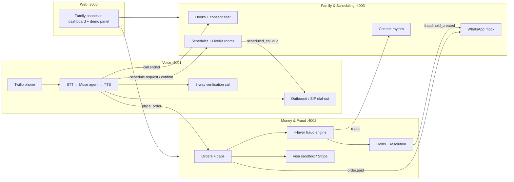

# Care Circle (v2)
*Working name. Tracks: **Meta** (Bringing People Closer Together with AI) + **Visa** (Reimagine Shopping with Generative AI). Model stack: **Meta Muse** for all reasoning; any voice models for the phone layer. The build kit for 4 parallel agents is in `care-circle-kit/`.*

> **One line:** A senior calls one phone number and just talks. The AI handles groceries, rides, and gifts, paid with a family-funded Visa credential that follows rules the family and senior set together. A four-layer fraud engine stops scams by connecting her to the real grandson. And the AI makes sure the family actually shows up: it schedules calls and visits around everyone's lives, and at call time her regular phone rings, straight into a family video call.

---

## 1. The thesis

> **The grandparent scam works because of disconnection.** A senior who rarely hears from their grandson can't tell the fake one from the real one. So the answer to loneliness and to fraud is the same thing: **more real contact with the people who love them.**

The Visa feature (fraud interception) *is* the Meta feature (connection), and v2 makes that literal. The scheduler creates a steady rhythm of real family calls, and that rhythm is one of the fraud engine's strongest signals. When the real Danny calls every Sunday, a Tuesday "emergency" from "Danny" stands out.

---

## 2. Why this matters now

- **The losses are exploding.** Older adults' reported fraud losses rose about fourfold, from about $600M in 2020 to $2.4B in 2024. The increase was driven largely by losses over $100,000, often to investment scams, romance scams, or impersonation (FTC, *Protecting Older Consumers 2024–2025*).
- **Reported losses are only a fraction.** The FTC estimates the true 2023 cost of fraud to older consumers may have been as high as $61.5B, because most fraud goes unreported.
- **Impersonation losses are growing fastest.** Combined losses from older adults who lost over $100,000 to impersonation scams rose eight-fold, from $55M in 2020 to $445M in 2024.
- **The pattern is well known.** Older adults are more likely to report losses to tech-support, prize, and friend-and-family impersonation scams. Gift cards are scammers' most-requested payment method, while wire transfers carry the largest losses.
- **YC is asking for exactly this.** The Fall 2026 RFS *AI for the Aging Population* argues that almost no technology is built for older people and that even Alexa and Google Home frustrate most seniors. It calls for voice interfaces that hold real conversations and software that helps family caregivers coordinate care, noting that 53 million family members already do this work unpaid.

---

## 3. Where the idea comes from

It merges two Y Combinator companies and refactors them around connection.

**GoGoGrandparent (YC S16)** is a phone-based concierge for older adults: rides, meals, medication, groceries, and home maintenance, all through a regular phone call. It still runs on a press-a-number menu and human operators. **Our change:** replace the menu and operators with a natural voice agent.

**True Link (YC)** puts personalized fraud protection on prepaid Visa cards. Adult family members usually sign up their relative, and they can cap purchases and block likely scams. **Our change:** make the protection AI-driven and relational, not just rule-based.

**What both miss:** the family's role is **oversight** (approve, block, monitor). Care Circle makes the family's role **participation**.

---

## 4. The product

### Who it's for
- **The user:** an older adult living independently who may not use apps at all. They are the user, not the subject.
- **The care circle:** adult children, grandchildren, and siblings, often spread across cities and time zones. Grandkids under 18 are reached only through their parent.

### The connection mechanics

**1. Scam response = a real call, not a block.**
When the fraud engine flags a request, the agent says *"Let's check with Danny first. Want me to call him now?"* It then patches in the real Danny, on his stored number, on a three-way call. The fraud is beaten by a moment of real contact. (Full engine in §5.)

**2. Grandparents give, not just receive.**
"Order a birthday cake for my granddaughter" works because the agent knows the family calendar. "Send my son that barbecue sauce he likes" works because it heard about it on an earlier call.

**3. Errands become invitations.**
When Rose orders groceries, the circle gets a WhatsApp prompt: *"Rose's order goes out tomorrow. Add something?"* A grandkid adds a pastry plus a 10-second voice note that plays at delivery.

**4. Conversation hooks, not status reports.**
The agent picks up small things from calls, like "the tomatoes came in" or "worried about Buddy's vet visit." It routes each one to the person who'd care: *"Rose's tomatoes came in. You helped her plant them. Give her a call?"* The family never sees "Mom spent $62."

**5. Shared care load.**
A pooled credential lets siblings split costs automatically, and the AI spreads tasks fairly. The tone is warm, never guilt-tripping.

**6. Scheduled time together.** *(New in v2; full design in §6.)*
The AI finds times that fit everyone, confirms with Rose by voice, and briefs the family with conversation starters. At call time, her regular phone rings.

### Consent model (non-negotiable)
- **The senior decides what's shared.** "Keep this between us" is enforced in code, and the agent says out loud that it will.
- **Spending limits are set with the senior**, not imposed on them.
- **No impersonation, no voice cloning, ever.**
- **The agent never replaces a call that should be human**; it prompts humans to call.
- **Nobody under 18** is ever messaged or called directly.
- **Success metric:** *connection moments per week* (calls, voice notes, gifts, added items), not orders placed.

---

## 5. AI fraud detection

Every purchase request passes through four layers.

| Layer | What it catches | Can the model override it? |
|---|---|---|
| **1. Hard rules** | Gift cards to non-circle recipients, wire transfers, crypto, money transfers, new payees over $50, over-cap amounts, secrecy language ("don't tell your mom"), cash-courier setups | **No.** Deterministic code. |
| **2. Scam-story classifier (Muse)** | Reads *why* Rose is buying and maps it to a scam type: grandparent impostor, government/Medicare/IRS impostor, tech support, prize/lottery, romance, investment, bank "safe account," cash courier, fake charity | Adds risk |
| **3. Personal baseline** | Anomalies against Rose's own 60-day history: new merchant, amount 5× her median, a request at 2am, a category she's never used | Adds risk |
| **4. Relationship signal** | Uses the family's real contact pattern. *"Caller claimed to be Danny. Danny calls Rose most Sundays, last spoke 2 days ago, and has never asked for money. This 'emergency' isn't in any family channel."* | Adds risk |

**Scoring:** the layers add to a 0–100 score.
- **High** (any hard stop, or a score of 60+) → hold.
- **Medium** (30–59) → verify with family before paying.
- **Low** → proceed.

### What happens on a high-risk request
1. **Hold, never scold.** Rose hears: *"This looks like a trick a lot of people get calls about. Let's check with Danny before we send anything."* The agent never says "scam" or "you're being fooled."
2. **Verify on a known number.** The agent calls the verifier on the number **stored in the circle**, never a number the caller gave. This defeats voice-cloned "grandson" calls, because the real Danny answers his real phone.
3. **Three-way call.** Rose and Danny talk live. Danny confirms or cancels out loud, and the agent repeats the decision back before acting.
4. **Family code word.** The family sets a private phrase, and afterward the agent reminds Rose to ask any "emergency" caller for it. The agent never says the word itself.
5. **Cooling-off.** If no verifier answers within 30 minutes, the purchase holds for 24 hours, then cancels. **High-risk holds never auto-release.** Releasing one needs a family member's passkey.
6. **"Why we paused" card.** Every verifier gets a plain-English WhatsApp card: what was asked, the top three signals, and buttons for "I'm calling her," "Cancel it," and "Approve in app (passkey)."

### It must not over-block
The engine has to let normal life through. *"A $25 gift card for Mia's birthday"* passes: Mia is in the circle through her mom, her birthday is on the calendar, and the amount is normal. A bigger Thanksgiving grocery order or a new farm stand for a normal amount also passes.

**Eval set:** 24 scripted scenarios, 12 scams and 12 legit, including the tricky ones above. **Target: catch all 12 scams, with no more than 2 legit requests held as high-risk.** The demo panel shows the live eval score.

---

## 6. Scheduling time with the children

### Three triggers
- **Rose asks:** *"I'd love to see the kids."*
- **Family asks:** Lisa messages *"set up a call with Mom."*
- **The AI notices a gap:** the usual Sunday call has been missed twice. It nudges **the family, never Rose**, and never with guilt.

### How it finds a time
- **Hard constraints are checked in code:** Rose's routine (naps, church, booked rides), a comfortable window for her, each member's time zone and availability, and grandkids' school hours (through their parent).
- **Muse ranks the valid slots** and writes a reason for each: *"Sunday 4pm works for everyone, including Mark at 9pm in London, and Mia's out of school."*
- **The family picks** from three proposed slots with one tap on WhatsApp.
- **Rose confirms by voice**, either on her next call or during a short outbound call: *"Sunday at 4, Lisa, Danny, and Mia will all be on. Sound good?"*

### Before the call
- **One hour before:** each family member gets a briefing of what Rose mentioned lately (consent-filtered), as conversation starters.
- **Thirty minutes before:** Rose gets a friendly reminder call.

### The call rings Grandma's regular phone
- No app, no link, no "tap to join." At call time, **Rose's normal phone rings**, and her audio is bridged into a video room where the family is on camera.
- **Plan A:** LiveKit room plus SIP dial-out to her phone.
- **Plan B:** a big-button tablet page that auto-answers calls only from circle members.
- The AI speaks one line (*"Rose, Lisa and the kids are here!"*), then **leaves the call.**

### After the call
- The call is logged as a connection moment.
- The AI offers *"Make this a weekly Sunday call?"* and rotates the host fairly across siblings.

### Visits too
In-person visits use the same flow, then connect back to commerce: *"Lisa's visiting Saturday. Want groceries for lunch?"* or a ride to Lisa's house.

---

## 7. Why AI is essential

| Without AI | With AI |
|---|---|
| Press-number menus seniors struggle with | Natural conversation: "the usual groceries, and a ride to Dr. Lee Thursday" |
| Static fraud rules that miss social-engineering context | Muse reads *what's being asked and why*: urgency, secrecy, authority claims, "don't call your family" |
| No sense of what's normal for this person or family | Personal baseline plus relationship signal: a request can be flagged because it doesn't fit *Rose's* life |
| Family learns about Grandma's life through transaction logs | Muse extracts meaningful hooks and routes each to the right person |
| Scheduling across four time zones, naps, school, and church by group text | The AI finds valid slots, explains them, and confirms with Rose by voice |
| Calls that start with "so, what's new?" | Pre-call briefings give everyone something real to talk about |

---

## 8. Why this is a Visa story

- **Discovery and decision:** voice ordering from Rose's usual stores, with memory of "the usual."
- **Checkout:** voice-initiated purchases on a scoped agent credential, with spoken confirmation before every payment.
- **Trust:** a four-layer fraud engine protecting the population most targeted by payment fraud, blocking the payment methods scammers prefer (gift cards, wires) before money moves.
- **Multi-payer:** siblings co-fund one credential, and grandkids pay for items they add to Rose's order.
- **Post-purchase:** delivery voice notes, receipts, and "why we paused" cards.

**Visa Intelligent Commerce** maps onto this directly: it's free in sandbox for independent developers and offers agent-specific payment tokens, controls tied to the user's authenticated instruction, passkey authentication, and an MCP server. The funding family member sets up the credential with a passkey. Rose's verbal approvals work *within* the pre-authorized caps, and anything outside them escalates to a human passkey.

**Pitch line for Visa judges:** *"The safest payment for a senior isn't the one that's blocked. It's the one their grandson confirmed on a call."*

---

## 9. Tech stack

| Layer | Choice | Notes |
|---|---|---|
| Reasoning, voice agent, tools | **Muse Spark** via Meta Model API (`https://api.meta.ai/v1`, OpenAI-SDK compatible) | `muse-spark-1.1`; check docs for newer. Function calling plus structured outputs. |
| Fraud classifier | **Muse Spark** (structured output) plus deterministic rules | Rules can never be overridden by the model |
| Post-call hooks, scheduling rank, briefings | **Muse Spark** | Hard scheduling constraints enforced in code |
| Speech-to-text | **Muse Voice Transcribe 1.0**; streaming fallback provider if too slow | Speaker-aware, with keyword biasing for family and store names |
| Text-to-speech | Any provider | Warm, slow, clear. Streamed. |
| Telephony | Twilio (phone number, media streams, Conference for 3-way calls) | |
| Family video | LiveKit (rooms; SIP dial-out to Rose's phone) | Plan B: tablet auto-answer page |
| Payments | **Visa Intelligent Commerce sandbox**; fallback: Stripe test mode | Scoped credential, caps, passkey |
| Family surface | WhatsApp mock (WhatsApp Business API as a stretch) | |
| App | TypeScript monorepo: Fastify services, Next.js web, one Postgres with a schema per service | |

### Architecture

### Safety rules in code, not just the prompt
- **Hard stops** (gift cards to non-members, wires, crypto, new payees, over-cap) pause the purchase no matter what the model says.
- **Verification** only ever dials numbers stored in the circle.
- **High-risk holds** release only with a family passkey, and never automatically.
- **Private spans** are stripped before any text reaches hooks, nudges, or briefings.
- **Scheduling constraints** (naps, school hours) are validated in code, not trusted to the model.
- **Medication:** reorders of existing prescriptions only. No suggestions or advice.
- **No message or call** is ever addressed to anyone under 18.

---

## 10. 72-hour build: 4 agents on 4 computers

The full kit is in `care-circle-kit/`: a README, `CONTRACTS.md`, and one `CLAUDE.md` brief per agent.

| Agent | Owns | Riskiest part |
|---|---|---|
| **1 · Voice** | Phone line, conversation loop, 3-way verification call, dialing Rose into family calls | Latency (spiked first, at hours 0–3) |
| **2 · Money & Fraud** | Credential, caps, payments, 4-layer fraud engine, 24-scenario eval set | Catching every scam without over-flagging |
| **3 · Family & Scheduling** | Circle, WhatsApp mock, hooks, scheduler, video rooms, contact rhythm | Time-zone and routine constraints |
| **4 · Integrator + Web** | Monorepo, shared types, family screens, demo panel, E2E tests, final merge | Keeping everything integrated |

**How they stay in sync without talking to each other:**
- `CONTRACTS.md` defines every API, event, type, and seed ID up front.
- Each agent builds against it from minute one, stubbing its dependencies.
- Each agent writes only inside its own folder and database schema.
- The human coordinator relays blockers, approves contract changes, and merges at checkpoints.
- Agent 4 runs end-to-end tests after every merge and reports failures to the owning agent.

| Checkpoint | Hour | What must work |
|---|---|---|
| 1 | H8 | All four services run together on stubs |
| 2 | H30 | Rose orders groceries by phone → paid → Lisa gets a nudge |
| 3 | H50 | Scam → hold → 3-way call → cancel, **and** schedule → confirm → phone rings → family video |
| Freeze | H62 | All 5 E2E scenarios pass 10 runs in a row |
| Ship | H66–72 | Demo recorded, write-up, README |

**Scope cuts if behind, in order:** sibling cost-splitting → gift sending → real WhatsApp (use the mock) → SIP dial-out (use Plan B tablet).
**Never cut:** the scam → three-way call moment, and the scheduled call ringing Rose's phone.

---

## 11. Demo script (3:00)

| Time | Scene |
|---|---|
| 0:00 | *"Older adults reported losing $2.4 billion to scams last year. Many of those scams start with a call from someone pretending to be family."* |
| 0:10 | Rose calls, orders groceries, and mentions her tomatoes. **Paid.** Lisa gets *"Add something?"* and adds a pastry and a voice note. |
| 0:40 | Rose: *"I'd love to see the kids."* Lisa's and Danny's phones get 3 proposed slots with everyone's local time. They tap Sunday 4pm. The agent confirms with Rose by voice. |
| 1:05 | **The scam.** Rose: *"My grandson called. He's in trouble and needs $500 in gift cards, and he said not to tell his mom."* On screen, the fraud drawer lights up: hard rule (gift card, non-circle recipient), classifier (grandparent impostor, secrecy language), relationship signal (Danny called Sunday and never mentioned it). Score: 92, high. |
| 1:25 | *"Let's check with Danny first."* The three-way call connects to Danny's stored number. The real Danny: *"Grandma, that wasn't me! Are you okay?"* He cancels out loud. Lisa's phone gets the "why we paused" card. |
| 1:55 | **Sunday, 4pm.** Rose's regular phone rings. She picks up and she's in the family video call. Danny's pre-call briefing mentioned the tomatoes, so he asks about them first. The AI says one line, then leaves. |
| 2:30 | Week view: *11 connection moments. 1 scam stopped. $500 saved.* |
| 2:45 | Close: *"The best fraud protection is a family that calls. Care Circle makes sure they do."* |

---

## 12. Required write-up (Meta submission)

**Who it's for.** Older adults living independently who find apps frustrating, and the families spread across cities who love them.

**How it strengthens connection.** Care Circle turns the chores of aging into moments of contact. Grocery orders become invitations for grandkids to add something and leave a voice note. Small details from Grandma's calls become prompts for the right family member to call her. The AI schedules family calls and visits around everyone's lives, gives each person something real to talk about, and rings Grandma's regular phone so she never has to open an app. When a scammer pretends to be a grandchild, the response is a live call with the real one. We measure success in connection moments per week, not orders.

**Why AI is essential.** Seniors need a voice interface that actually holds a conversation, not a phone menu. Stopping scams means understanding the story behind a request and whether it fits this person's life and this family's rhythm, which no static rule set can do. Scheduling across time zones, naps, school, and church, then briefing everyone with consent-filtered conversation starters, is language and reasoning work. Muse handles all of it, and agentic checkout with scoped credentials makes it safe to act on.

---

## 13. Risks and answers

| Judge question | Answer |
|---|---|
| "Isn't this surveillance of the elderly?" | The senior is the user. She controls what's shared, and "keep this between us" is enforced in code. The family sees reasons to call, not spending logs. |
| "Older adults report *less* loneliness than young adults." | True in Meta-Gallup's global data. Our target is the *family relationship* and the isolation that makes seniors vulnerable to fraud, not loneliness alone. |
| "Voice agents fail with seniors." | Latency is tested first, TTS is slow and clear, interruptions and repeats are handled, and any confusion escalates to a human family member. |
| "What if the fraud engine flags a real request?" | A false positive costs a phone call with family, which is a feature, not a failure. The eval set caps false high holds at 2 of 24. |
| "Voice-cloned grandkids?" | Verification only dials numbers stored in the circle, so a clone on an inbound call can't pass a callback to the real person. |
| "Can the AI be talked into releasing a hold?" | No. Hard stops are code, and high-risk releases need a family passkey. |
| "Won't scheduling nag people?" | Rhythm nudges go to the family at most once per gap, never to Rose, and never use guilt. |
| "Medication risk?" | Reorders only, from existing prescriptions at a listed pharmacy. No suggestions, no advice. |
| "How is this different from GoGoGrandparent or True Link?" | They do logistics and protection with the family as overseer. We make the family a participant and measure connection, not transactions. |

**A lesson from the category:** GoGoGrandparent drew criticism in 2017 because its site claimed operators screened drivers when it could only check ratings after a ride was booked. Be explicit about what Care Circle does and doesn't verify, and state in the README what's mocked.

---

## Sources
- FTC press release, *Protecting Older Consumers 2024–2025*: https://www.ftc.gov/news-events/news/press-releases/2025/12/ftc-issues-annual-report-congress-agencys-actions-protect-older-adults
- FTC report PDF: https://www.ftc.gov/system/files/ftc_gov/pdf/P144400-OlderAdultsReportDec2025.pdf
- FTC on impersonation scam losses (2025): https://ftc.gov/news-events/news/press-releases/2025/08/ftc-data-show-more-four-fold-increase-reports-impersonation-scammers-stealing-tens-even-hundreds
- FTC 2023 estimate of true losses: https://www.ftc.gov/node/86563
- FTC findings on scam types and payment methods (via FKKS): https://advertisinglaw.fkks.com/post/102ft8z/ftc-says-protecting-older-americans-is-one-of-its-top-priorities
- GoGoGrandparent (YC S16): https://ycombinator.com/companies/gogograndparent
- GoGoGrandparent phone menu: https://www.gogograndparent.com/about/how-we-work
- TechCrunch on True Link (YC): https://techcrunch.com/2013/08/01/yc-start-up-true-link-financial-is-out-to-help-the-elderly-avoid-scammers-with-pre-paid-visa-cards
- YC Requests for Startups, Fall 2026: https://www.ycombinator.com/rfs
- The Next Web on GoGoGrandparent criticism (2017): https://www.thenextweb.com/news/call-in-service-for-uber-rides-is-pissing-off-drivers-misleading-seniors
- Meta × Gallup, *Global State of Social Connections*: https://gallup.com/file/analytics/513347/Gallup-Meta-Global%20State%20of%20Social%20Connections%20Report-2023.pdf
- Visa Intelligent Commerce: https://developer.visa.com/capabilities/visa-intelligent-commerce
- Meta Model API / Muse Spark: https://developer.meta.com/ai/resources/blog/build-with-muse-spark/
- Muse Spark on LiteLLM: https://docs.litellm.ai/docs/providers/meta
- Muse Voice Transcribe 1.0: https://openrouter.ai/meta/muse-voice-transcribe-1.0
